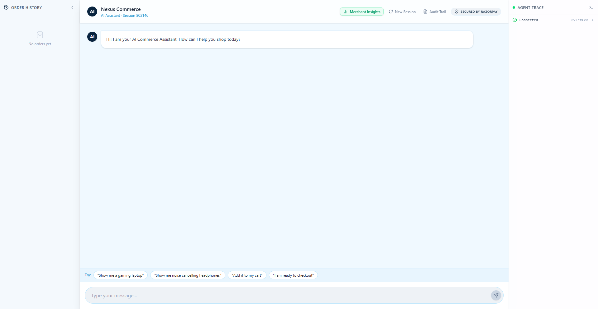
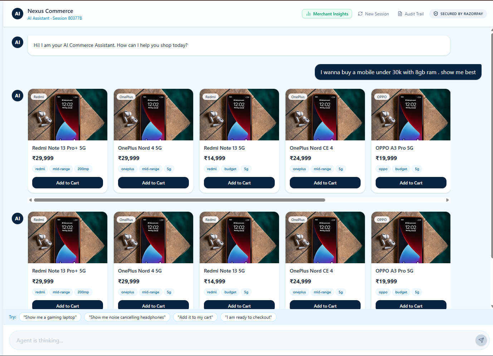
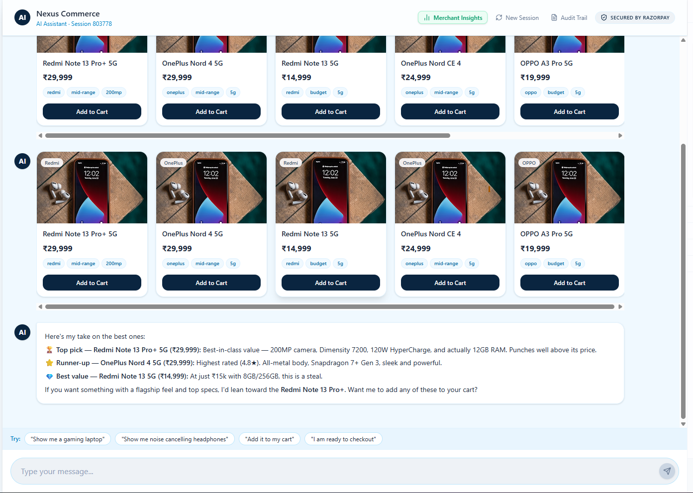
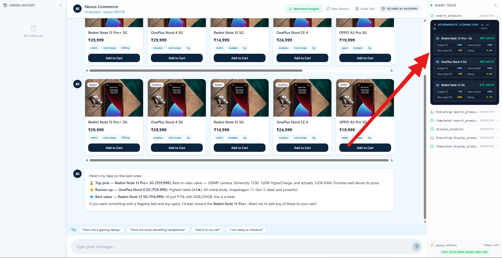
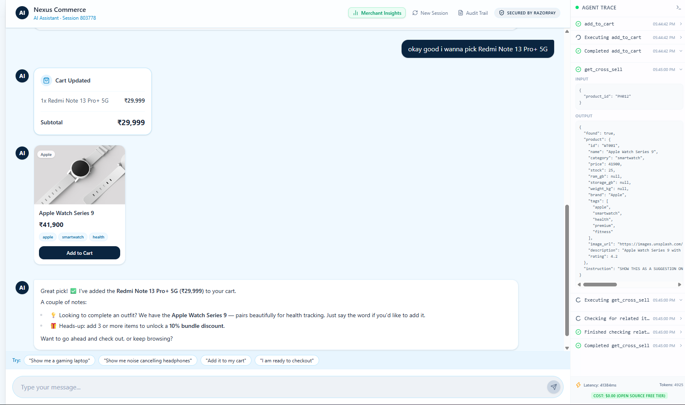
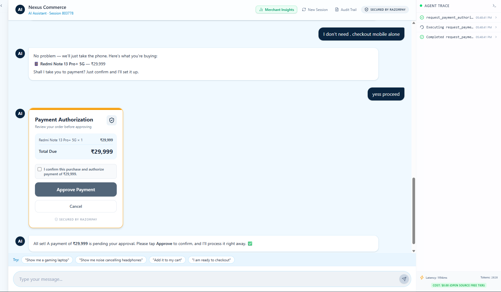
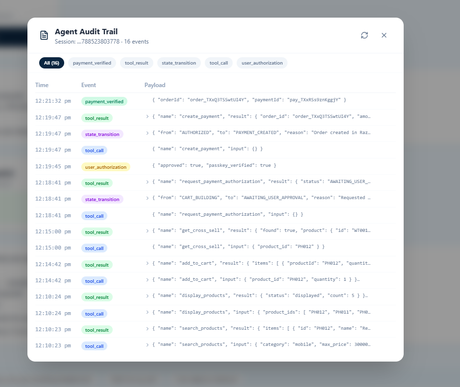
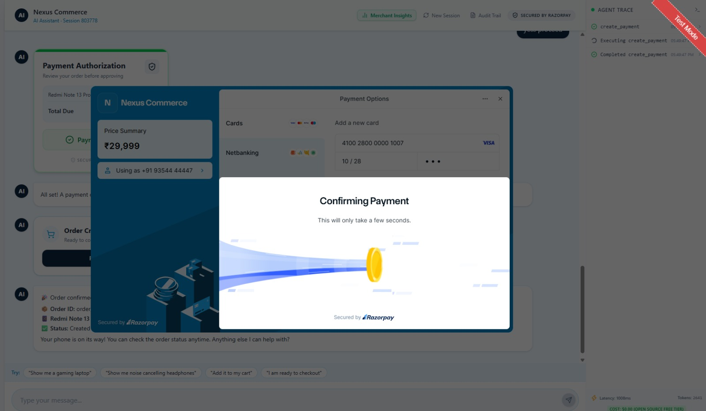
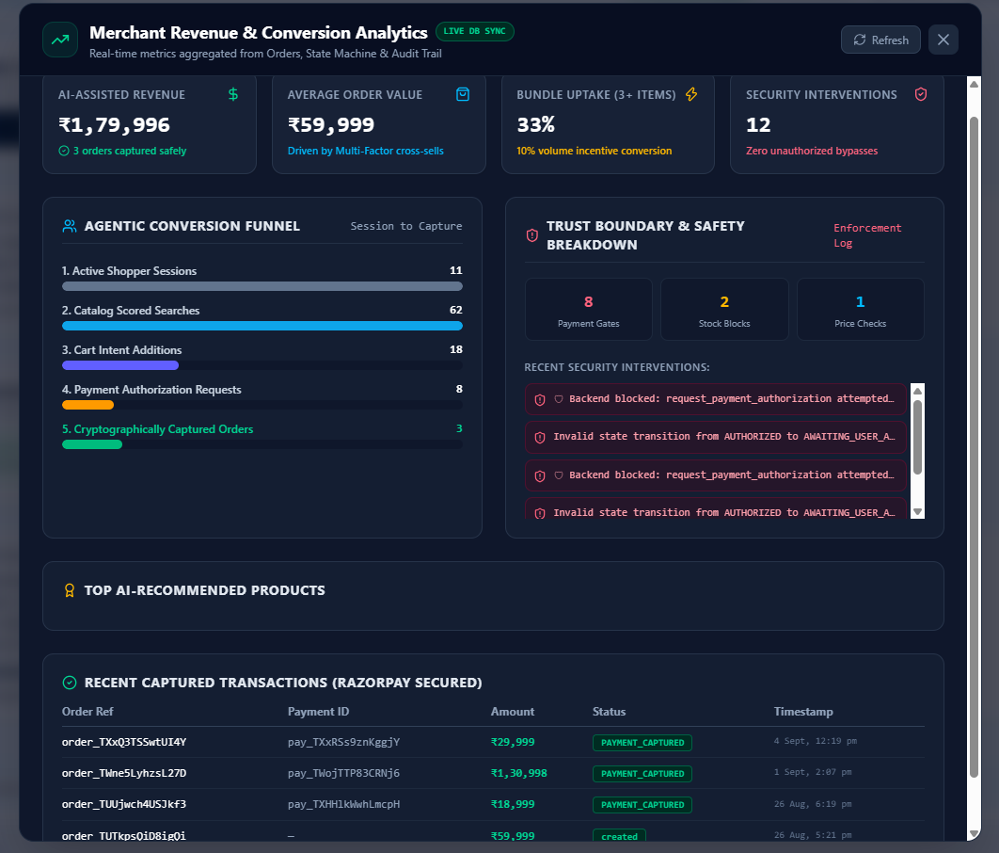

# 🛍️ Nexus Agentic Commerce

> An autonomous, secure, and revenue-optimizing AI Commerce Assistant built for the Razorpay Buildathon 2026.

Nexus is a next-generation AI shopping assistant that goes beyond simple chatbots. It operates on a strict **"LLM Proposes, Backend Disposes"** architecture — the AI drives the conversational UI, but a hardened backend state machine enforces strict cryptographic, stock, and payment trust boundaries. The AI can suggest anything; it cannot execute anything without passing through deterministic, tested backend guardrails.

---

## ✨ Key Features & Differentiators

### 🧠 Agentic Commerce & Negotiation
- **Deterministic Multi-Factor Recommendation**: Product suggestions aren't hallucinated or ranked by LLM impression. The backend scores every result with a weighted formula: `w1*budgetFit + w2*useCaseMatch + w3*valueScore + w4*featureMatch + w5*avgRating`. The full breakdown is visible in the Agent Trace panel (see [proof](#-proof--live-app-screenshots) below).
- **Proactive Alternatives**: If a strict constraint (e.g. "mobile under ₹20k") yields zero results, the backend autonomously broadens the search to entry-level alternatives instead of dead-ending the user.
- **Smart Cross-Selling**: Context-aware accessory suggestions are visually offered — never auto-added — immediately after a primary product is added to cart.
- **Bundle Discounting**: A 10% discount automatically applies at 3+ cart items, computed once and reused identically for both the on-screen total and the actual Razorpay charge amount.

### 🛡️ Ironclad Trust Boundaries & Security
- **Backend State Machine Guardrails**: The LLM cannot arbitrarily call payment functions. The backend enforces strict transitions: `CART_BUILDING → AWAITING_USER_APPROVAL → AUTHORIZED → PAYMENT_CREATED → PAYMENT_CAPTURED`.
- **Explicit, State-Machine-Only Authorization**: Every checkout requires an explicit in-chat approval step (review order → confirm → approve) before `create_payment` is even attempted. *Note: an earlier iteration used WebAuthn/biometric approval; it was removed in favor of this state-machine-only gate, since the real security guarantee was always the explicit, logged approval step — not the biometric hardware, which isn't universally available on demo/judging machines.*
- **Visible Security Interventions**: If the AI attempts an unauthorized action (creating a payment out of order, adding out-of-stock items, a price mismatch), the backend blocks it and logs a real-time intervention directly to the Agent Trace panel and audit trail.
- **Idempotent Checkouts**: Razorpay orders are linked to session state via a unique idempotency key per authorization — verified to prevent duplicate charges even under repeated/glitched calls.
- **Signature-Verified Payments**: Razorpay success callbacks are verified server-side via HMAC SHA-256 before any order is marked captured. Tampered signatures are rejected — tested.

### 📊 Real-Time Merchant Analytics
- **Live Database Sync**: A Merchant Insights dashboard aggregates live data from the Orders, Session, CartItem, and Audit Log tables.
- **Agentic Conversion Funnel**: Active sessions → scored searches → cart additions → authorization requests → captured orders.
- **Revenue Impact**: AI-assisted revenue, average order value, bundle uptake rate, security intervention count, and a ledger of recent captured transactions.

---

## 🛠️ Technical Architecture

### Backend (Node.js / Express / SQLite)
- **Agent Loop**: Tool-calling loop against Groq's free-tier API for high-speed, zero-cost reasoning. *(Model string in use: verify against `.env` before submission — confirm exact Groq model name here.)*
- **Tool Executor**: Intercepts LLM tool calls (`search_products`, `add_to_cart`, `get_cross_sell`, `request_payment_authorization`, `create_payment`, etc.) and routes them through local business logic and security validation — the LLM never touches the database or payment API directly.
- **Server-Sent Events (SSE)**: Streams real-time agent reasoning, UI blocks (product carousels, cart summaries, auth cards), and trust-boundary interventions directly to the frontend.
- **Razorpay Integration**: Idempotent `orders.create`, real Checkout invocation, and HMAC SHA-256 signature verification on capture.

### Frontend (React / Vite / Tailwind)
- **Dynamic Rendered UI**: The chat stream mounts rich components (product carousels, cart summaries, authorization cards) from typed SSE events — not parsed text.
- **Agent Trace / Thinking Panel**: A transparent live console exposing tool calls, scoring breakdowns, latency/token/cost stats, and security blocks in real time.

---

## 🚀 Getting Started

### Prerequisites
- Node.js (v18+)
- Razorpay Test Account Keys
- Groq API Key

### 1. Backend Setup
```bash
cd backend
npm install
# Create a .env file based on .env.example with RAZORPAY_KEY_ID, RAZORPAY_KEY_SECRET, GROQ_API_KEY
node server.js
```
*The backend runs on http://localhost:3001 and auto-initializes the SQLite catalog database.*

### 2. Frontend Setup
```bash
cd chat-ui
npm install
npm run dev
```
*The frontend runs on http://localhost:5173.*

---

## 📸 Proof — Live App Screenshots

Real captures from a live session (Session 803778), not mockups — included here as direct evidence for every claim made above.

### 1. Landing — Conversational Entry Point

Clean chat-first entry point. No menus, no filters — just a conversation, with the Agent Trace panel and audit trail one click away at all times.

### 2. Natural Language Search → Real Catalog Results

Query: *"I wanna buy a mobile under 30k with 8gb ram, show me best."* Real catalog products render as cards mid-conversation, streamed via SSE as the backend finds them — not generated text.

### 3. AI Recommendation Explanation

The agent explains its top pick, runner-up, and best-value option in plain language — grounded entirely in the scored results it received back from the backend.

### 4. Deterministic Scoring Breakdown (Live)

The Agent Trace panel shows the actual per-product score: Budget Fit, Intent Match, Value (Spec/₹), and Rating for each ranked result — proof the ranking is math, not model guesswork. Also visible: real latency, token count, and **$0.00 cost (open-source free tier)**.

### 5. Cart Update + Deterministic Cross-Sell

Adding the Redmi Note 13 Pro+ triggers an automatic `get_cross_sell` tool call — shown live in the trace panel with its real input/output JSON — surfacing the Apple Watch Series 9 as a complementary suggestion, plus a proactive nudge toward the 3-item bundle discount.

### 6. Explicit Payment Authorization Gate

No payment proceeds without this explicit card: itemized total, a confirmation checkbox, and a clear **Approve / Cancel** choice. This is the state-machine gate in practice — `request_payment_authorization` was called, and the backend is now waiting on an explicit user decision before anything else can happen.

### 7. Full Agent Audit Trail

Every tool call, tool result, and state transition for the session, timestamped — including the exact `state_transition` from `CART_BUILDING → AWAITING_USER_APPROVAL → AUTHORIZED → PAYMENT_CREATED`, and the final `payment_verified` event with the real Razorpay order and payment IDs. This is the explainability artifact: nothing in this trail is inferred or reconstructed after the fact — it's the literal log of what happened.

### 8. Real Razorpay Test-Mode Checkout

The actual Razorpay Checkout overlay — test mode clearly flagged — confirming payment via Razorpay's own UI, not a mocked success screen.

### 9. Merchant Revenue & Conversion Dashboard

Real-time metrics aggregated directly from the Orders, State Machine, and Audit Trail — AI-assisted revenue, average order value, bundle uptake, and a live security intervention count (**12 interventions, zero unauthorized bypasses**) — reframing the product from "shopping chatbot" to a measurable merchant revenue tool.

---

## 💡 The Pitch

For consumers, Nexus is a contextual personal shopper that understands their needs in plain language. For merchants and payment platforms, Nexus is a revenue-driving engine that enforces strict, auditable trust boundaries — proving that AI-driven commerce can be both profitable and safe, built entirely on a free-tier LLM stack.
